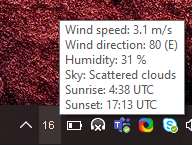

# clj-openweather-tray

System tray app for Windows OS written in Clojure that shows outside temperature in given city 
using data from openweathermap.org. 
Color of text is changing based on the temperature.
Supports both Celsius and Fahrenheit scale.

Tooltip contains additional weather info (wind speed, direction, sunrise, sunset, etc.)

Screenshot:

## Motivation

I created this application for two reasons:
1. To learn Clojure Java interop.
2. I'm using similar application but it displays cloud/sun/whatever icons instead of outside temperature:
https://github.com/FelixdelasPozas/TrayWeather. I recommend it if you need more functionality.

## Build

    lein uberjar

## Installation

1. Copy generated standalone jar file somewhere along with the config file and bat file, e.g:
    
        mkdir somedir
        cp .\target\uberjar\clj-openweather-tray-0.0.3-standalone.jar somedir\
        cp .\clj-openweather-tray-conf.edn somedir\
        cp .\clj-openweather-tray.bat somedir\
    
2. Open config file and add city-id and api-key.

* You can get list of city ids here: http://bulk.openweathermap.org/sample/.
* Follow these instructions to get your api key: https://openweathermap.org/api.

## Usage

Run bat file:

    .\clj-openweather-tray.bat

## TODO
Create binary using GraalVM's native-image. Swing support is still missing: https://github.com/oracle/graal/issues/1327.

## Findings
16 pixels, which is the size of tray icon on Windows OS, is not much if you want to fit 3 or 4 chars inside and still
be able to read it :)

## License

Copyright © 2020 Miroslav Havrlent

This program and the accompanying materials are made available under the
terms of the Eclipse Public License 2.0 which is available at
http://www.eclipse.org/legal/epl-2.0.

This Source Code may also be made available under the following Secondary
Licenses when the conditions for such availability set forth in the Eclipse
Public License, v. 2.0 are satisfied: GNU General Public License as published by
the Free Software Foundation, either version 2 of the License, or (at your
option) any later version, with the GNU Classpath Exception which is available
at https://www.gnu.org/software/classpath/license.html.
